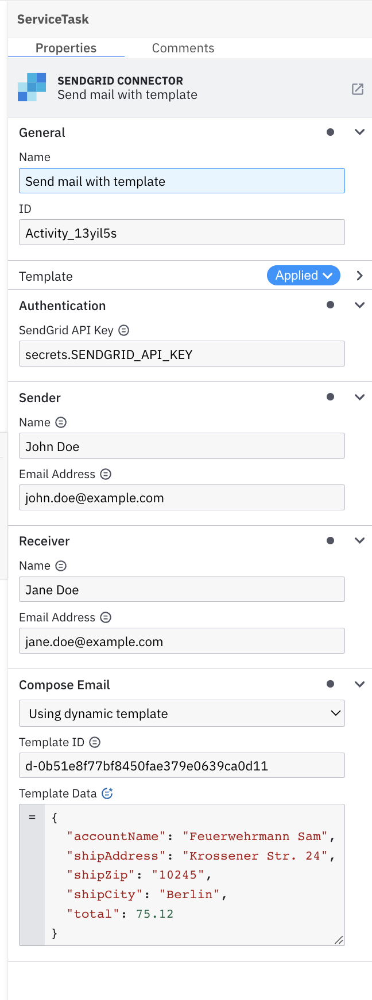

# cloud-connector-sendgrid

Camunda Cloud SendGrid Connector

## Build

```bash
mvn clean package
```

## API

### Input

```json
{
  "apiKey": "secrets.SENDGRID_API_KEY",
  "from": {
    "name": "John Doe",
    "email": "john.doe@example.com"
  },
  "to": {
    "name": "Jane Doe",
    "email": "jane.doe@example.com"
  },
  "template": {
    "id": "d-0b51e8f77bf8450fae379e0639ca0d11",
    "data": {
      "accountName": "Feuerwehrmann Sam",
      "shipAddress": "Krossener Str. 24",
      "shipZip": "10245",
      "shipCity": "Berlin",
      "total": 75.12
    }
  }
}
```

### Output

```json
{
  "error": "Error message if something went wrong"
}
```

## Test locally

Run unit tests

```bash
mvn clean verify
```

### Test as local Google Cloud Function

Build as Google Cloud Function

```bash
mvn function:run -Pcloud-function
```

The function will be available at http://localhost:9082.

Have a look at the [Camunda Cloud Connector Run-Time](https://github.com/camunda/connector-runtime-cloud) to see how your Connector function is wrapped as a Google Cloud Function.

### Test as local Job Worker

Use the [Camunda Job Worker Connector Run-Time](https://github.com/camunda/connector-framework/tree/main/runtime-job-worker) to run your function as a local Job Worker.

### email Template

If the email should be send with a template the request has to contain a `template` object.

```json
{
  "clusterId": "838d40dc-a4e2-42cd-a5fb-7e5ea993a970",
  "apiKey": "secrets.SENDGRID_API_KEY",
  "from": {
    "name": "John Doe",
    "email": "john.doe@example.com"
  },
  "to": {
    "name": "Jane Doe",
    "email": "jane.doe@example.com"
  },
  "template": {
    "id": "d-0b51e8f77bf8450fae379e0639ca0d11",
    "data": {
      "accountName": "Feuerwehrmann Sam",
      "shipAddress": "Krossener Str. 24",
      "shipZip": "10245",
      "shipCity": "Berlin",
      "total": 75.12
    }
  }
}
```

### Email Content

```json
{
  "clusterId": "838d40dc-a4e2-42cd-a5fb-7e5ea993a970",
  "apiKey": "secrets.SENDGRID_API_KEY",
  "from": {
    "name": "John Doe",
    "email": "john.doe@example.com"
  },
  "to": {
    "name": "Jane Doe",
    "email": "jane.doe@example.com"
  },
  "content": {
    "subject": "Testing with plain content",
    "type": "text/plain",
    "value": "Hello you, thanks for trying Camunda Cloud"
  }
}
```

## Element Template

The element templates for sending an email using a template or content can be found in
the [element-templates/sendgrid-connector.json](element-templates/sendgrid-connector.json) file.

### Properties: Send an Email using Template



### Properties: Send an Email using Content


## Build a release

Checkout the repo and branch to build the release from. Run the release script with the version to release and the next
development version. The release script requires git and maven to be setup correctly, and that the user has push rights
to the repository.

The release artifacts are deployed to Google Cloud Function by a github workflow.

```bash
./release.sh 0.3.0 0.4.0
```
