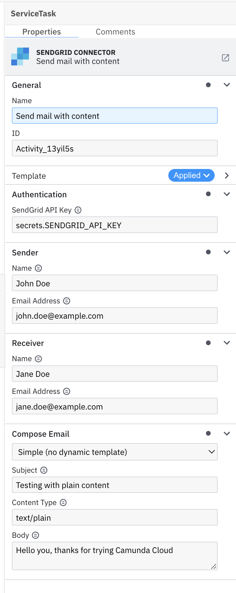

# Camunda SendGrid Connector

Find the user documentation in our [Camunda Platform 8 Docs](https://docs.camunda.io/docs/components/integration-framework/connectors/out-of-the-box-connectors/sendgrid/).

## Build

```bash
mvn clean package
```

## API

### Input

```json
{
  "apiKey": "secrets.SENDGRID_API_KEY",
  "from": {
    "name": "John Doe",
    "email": "john.doe@example.com"
  },
  "to": {
    "name": "Jane Doe",
    "email": "jane.doe@example.com"
  },
  "template": {
    "id": "d-0b51e8f77bf8450fae379e0639ca0d11",
    "data": {
      "accountName": "Feuerwehrmann Sam",
      "shipAddress": "Krossener Str. 24",
      "shipZip": "10245",
      "shipCity": "Berlin",
      "total": 75.12
    }
  }
}
```

### Output

```json
{
  "error": "Error message if something went wrong"
}
```

## Test locally

Run unit tests

```bash
mvn clean verify
```

### Test as local Job Worker

Use the [Camunda Job Worker Connector Run-Time](https://github.com/camunda/connector-framework/tree/main/runtime-job-worker) to run your function as a local Job Worker.

### :lock: Test as local Google Cloud Function

> **Warning**
> This is Camunda-internal only. The Maven profile `cloud-function` accesses an internal artifact.

Build as Google Cloud Function

```bash
mvn function:run -Pcloud-function
```

See also the [:lock:Camunda Cloud Connector Run-Time](https://github.com/camunda/connector-runtime-cloud) on how your function
is run as a Google Cloud Function.

### Email Template

If the email should be send with a template the request has to contain a `template` object.

```json
{
  "apiKey": "secrets.SENDGRID_API_KEY",
  "from": {
    "name": "John Doe",
    "email": "john.doe@example.com"
  },
  "to": {
    "name": "Jane Doe",
    "email": "jane.doe@example.com"
  },
  "template": {
    "id": "d-0b51e8f77bf8450fae379e0639ca0d11",
    "data": {
      "accountName": "Feuerwehrmann Sam",
      "shipAddress": "Krossener Str. 24",
      "shipZip": "10245",
      "shipCity": "Berlin",
      "total": 75.12
    }
  }
}
```

### Email Content

```json
{
  "apiKey": "secrets.SENDGRID_API_KEY",
  "from": {
    "name": "John Doe",
    "email": "john.doe@example.com"
  },
  "to": {
    "name": "Jane Doe",
    "email": "jane.doe@example.com"
  },
  "content": {
    "subject": "Testing with plain content",
    "type": "text/plain",
    "value": "Hello you, thanks for trying Camunda Cloud"
  }
}
```

## Element Template

The element templates for sending an email using a template or content can be found in
the [element-templates/sendgrid-connector.json](element-templates/sendgrid-connector.json) file.

### Properties: Send an Email using Template


### Properties: Send an Email using Content



## Build a release

Trigger the [release action](./.github/workflows/RELEASE.yml) manually with the version `x.y.z` you want to release and the next SNAPSHOT version.
Depending on the release version (major, minor, release candidate), the release artifacts are deployed to the respective Google Cloud Function by another GitHub workflow.
